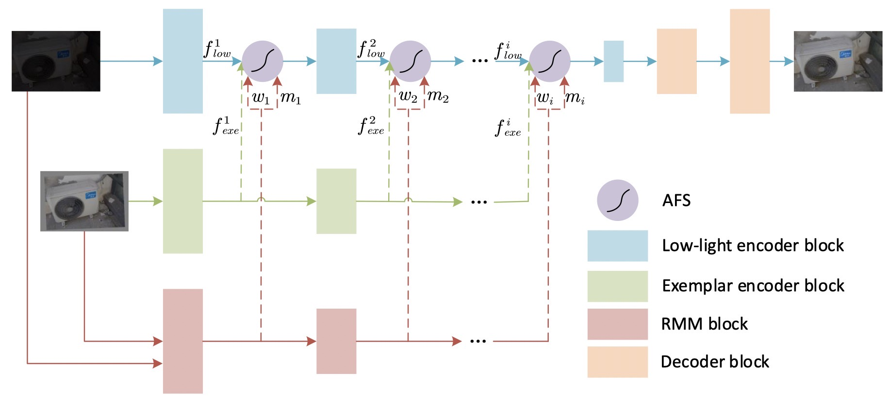
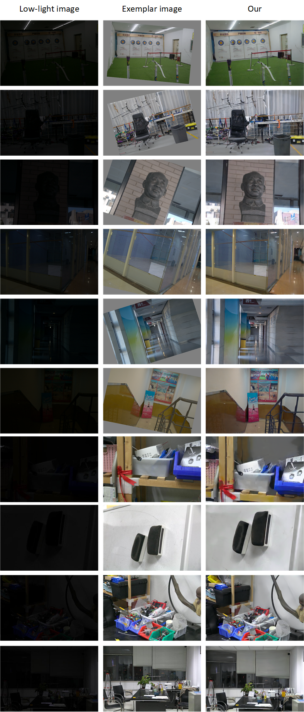

# EGLLIE
This repository contains the implementation of the paper Exemplar-Guided Low-Light Image Enhancement

The training code and inference code will be released after the paper is accepted!

# Network


# Dataset
[Onedrive]((https://mailustceducn-my.sharepoint.com/:u:/g/personal/ymshi_mail_ustc_edu_cn/EZSJ0WYflhROmRs4BW1JhckBak2tliVdxfbf6o6JvhstIQ?e=5KvYKd)
) password: 6666
```
LOL-v2
├── Real_captured
│   ├── train
│   │   ├── exem2   # office exemplar
│   │   ├── high    # LOL high
│   │   ├── label2  # office label
│   │   ├── low     # LOL low
│   │   └── low2    # office low
│   └── val
│       ├── exem2
│       ├── high
│       ├── label2
│       ├── low
│       └── low2
```
# Results
